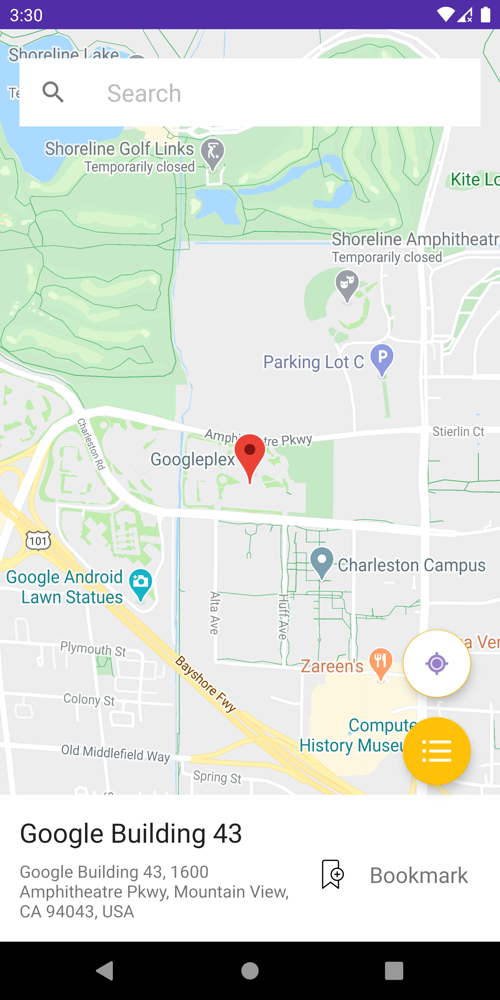
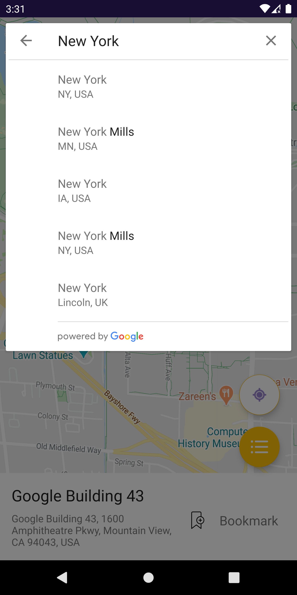
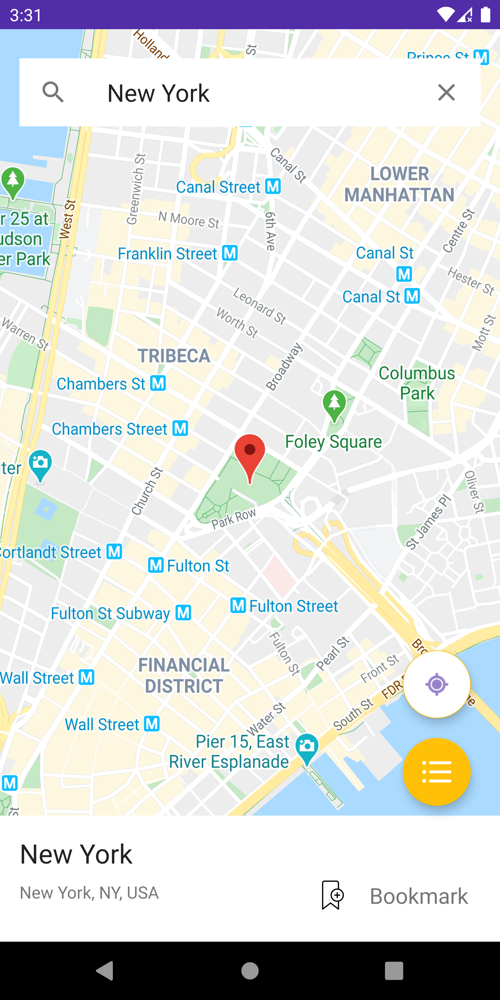
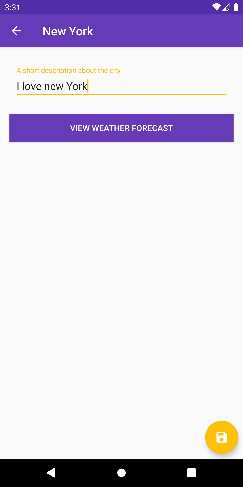
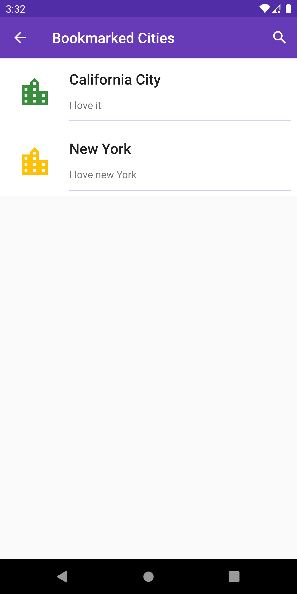
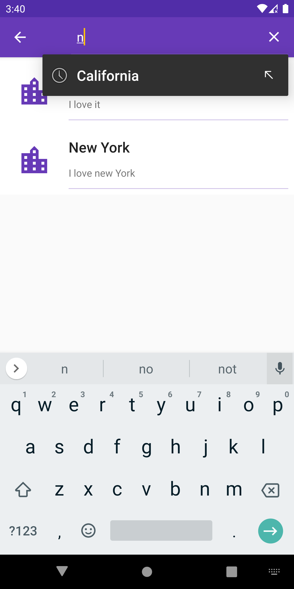
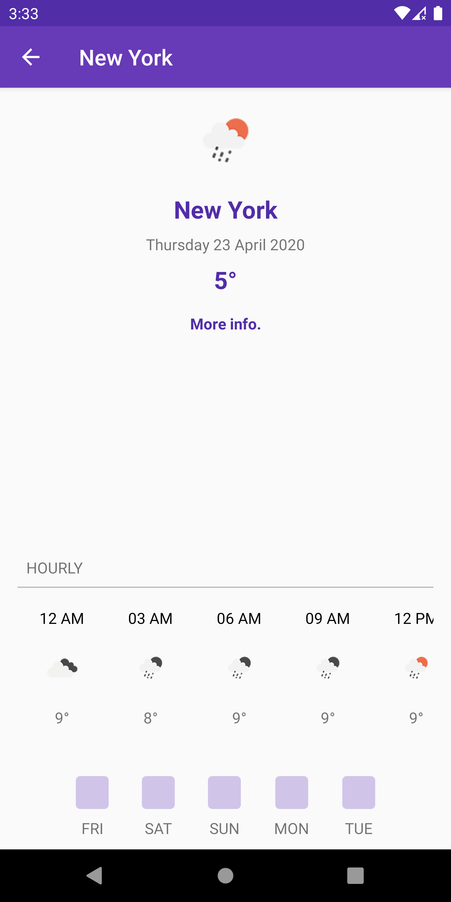
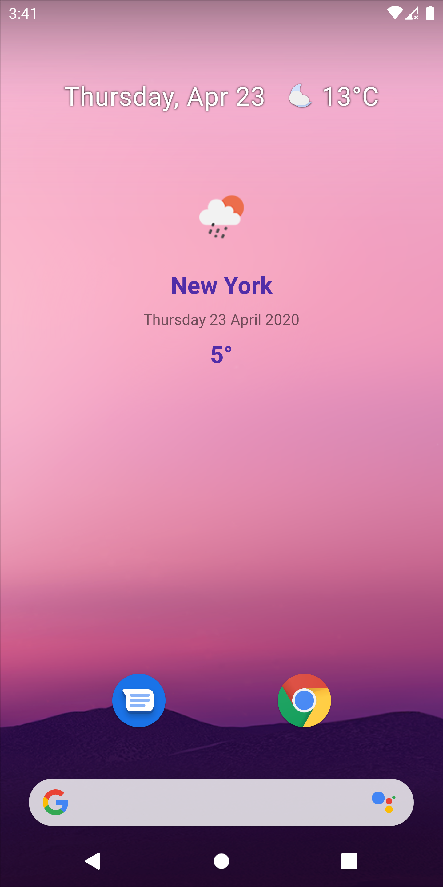

# City-Weather

City Weather is an App that allows users to search for their favourite cities in the world (on a Google Map), bookmark them, write about their experience or expectations in such cities, and view weather information about such cities for the next 5 days to enable them to plan their trips better. <br/>

The App is aimed at helping travellers know about the weather conditions of the Cities they are going to travel to, and also share their reviews about the cities after the visit. <br/>
The App allows travellers to know the 5 days hourly weather forecast for a city they plan to visit, so that they can plan and pack their bags accordingly. <br/>

Reviews of the user are stored on a local database cache, and the user can share their review on other Apps like WhatsApp, Facebook etc.

## Features

* The App shall display a Google map, initially focusing on the User’s current location.
* The User shall search for a city of choice using a search bar.
* The Focus of the map shall be set to the user’s selected city.
* The App shall show basic information (name of city and address) about a city selected
  by a user.
* A user shall press a bookmark button that shall take them to an interface where they can
  write reviews/expectations or just general thoughts about that city.
* User Reviews shall be stored locally on the device.
* A user shall be presented with a 5 days hourly weather forecast for that city.
* A list view with cities bookmarked by the user shall be presented.
* A user shall be able to search through the bookmarked cities to select a city of choice.
* When a city is selected from the bookmarked cities list, the user shall be able to view a 5
  days Hourly weather forecast for that city.
* The App shall have a widget that displays weather information for a selected city

## How to Run the Project

In order to Run the project, please follow this.
1. Create a `keystore.properties` file in the root folder of the project (city-weather/keystore.properties)
2. Add your API_KEYS to this file. I didn't commit it to GitHub due to security concerns. However, this is a sample file that you can use to run the project.
```
OPEN_WEATHER_API_KEY="<open-weather-api-key>"
GOOGLE_MAPS_API_KEY="<google-maps-api-key>"
KEY_ALIAS=cityWeatherAlias
KEY_STORE_FILE=./../city-weather-keystore
KEY_STORE_PASSWORD=CityWeather
KEY_PASSWORD=CityWeather
```
3. Create your Open weather API key here; https://openweathermap.org/api
4. Create your Google API Key (`http://console.cloud.google.com/`), and enable the Google Maps and Google Places SDKs for the API Key.
5. Add them to the `keystore.properties` file and you're ready to build and run the project.

## Screenshots

 
 

 
 

### App Widget



### Libraries Used

1. Retrofit:
   To handle fetching of data from the open weather api. This library is efficient at making network requests. It incorporates a GSON Converter that enables effective Serialization and Deserialization of JSON Requests and Responses.

1. Room:
   To handle data persistence. This is the recommended persistence library from Google.

1. Picasso:
   To handle loading and caching of weather icons.

1. Google Maps:
   To display a Map to the user, and drop a pin to the user’s selected city.

1. Google Places:
   To get more information about the selected city and also enable searching for Cities.

1. Material Design:
   To add material design to the project and hence follow Google’s recommended App Design Guidelines.

1. WorkManager:
   To handle routine asynchronous fetching of weather data even when the user is not actively interacting with the App.

1. Stetho:
   To enable professional debugging of the App during development.

1. Butterknife:
   To handle view binding and reduce boilerplate code.

1. Android Architecture Components:
    LiveData, ViewModel and WorkManager.
